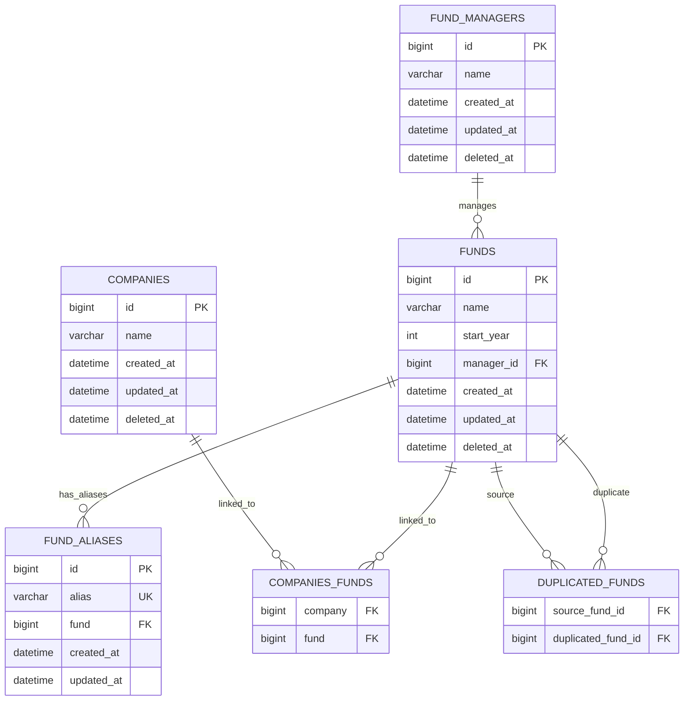

# FMS
Small Fund Management System

## Project structure

- `backend`: Laravel API/application
- `frontend`: Vue 3 + Vite application

## Run with Docker Compose

From the repository root:

```sh
docker compose up -d
```

Applications:

- Frontend: http://localhost
- Backend: http://localhost:8000

## Database ER diagram


