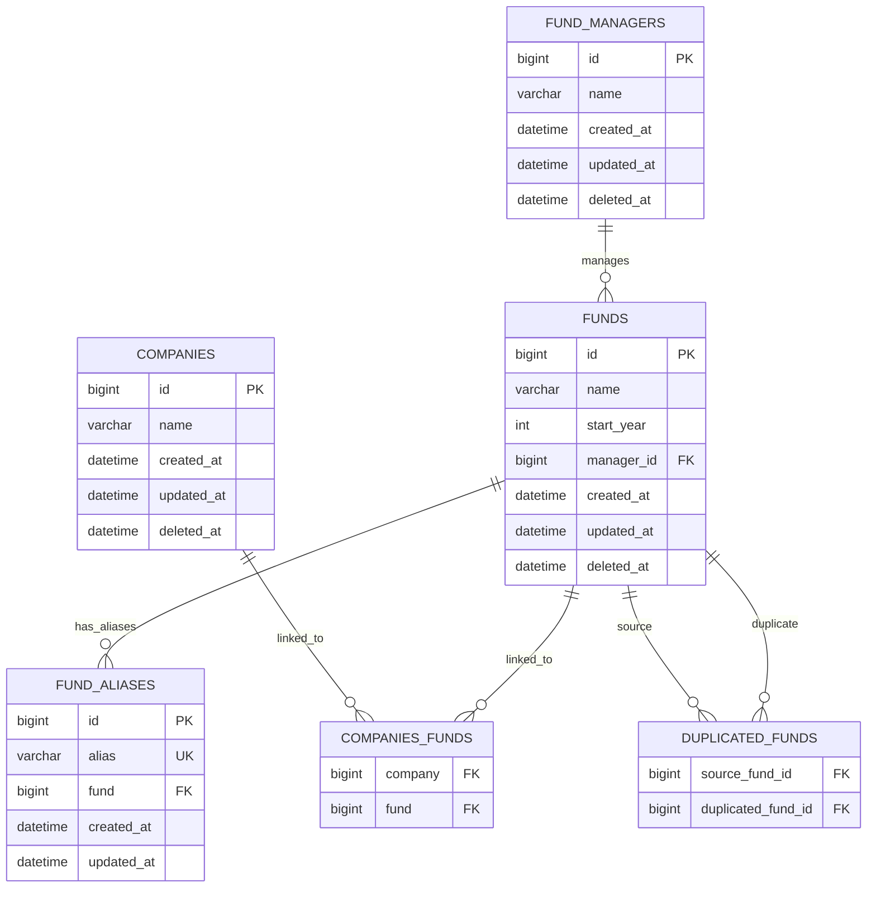

# FMS
Small Fund Management System

## Project structure

- `backend`: Laravel API/application
- `frontend`: Vue 3 + Vite application

## Run with Docker Compose

From the repository root:

```sh
docker compose up -d
# or
make up
```

## Testing with Docker Compose

```sh
docker compose exec backend php artisan test
# or
make test
```

## Backend architecture (`backend`)

The backend follows a Clean Architecture-inspired structure to keep business rules independent from framework and delivery concerns.

- `src/Core`: domain and application rules (entities, use cases, contracts)
- `src/Infrastructure`: framework/external implementations (database, persistence, integrations)
- `src/Interface`: delivery layer adapters (controllers, HTTP-facing coordination)

This separation helps keep the domain logic testable, easier to evolve, and less coupled to Laravel internals.

## Frontend architecture (`frontend`)

The frontend uses a component-based approach with Vue 3, where UI is composed from reusable, focused components.

- `src/components`: reusable UI building blocks
- `src/pages`: route-level page composition
- `src/router`: navigation and route configuration
- `src/services`: API/data access responsibilities
- `src/types`: shared TypeScript types/interfaces

This organization promotes reuse, clearer responsibilities, and easier maintenance as features grow.

Applications:

- Frontend: http://localhost:5173
- Backend: http://localhost:8080

## Technical assumptions and design decisions
- Although Clean Architecture has a learning curve and may introduce some boilerplate, it provides long-term benefits in maintainability and testability, especially as the application grows.
- I'm not using Eloquent Models because it would add complexity to the Clean Arch structure. Instead, I'm using Laravel's Query Builder for database interactions. This makes the data access layer more explicit.
- For simplicity, I'm not implementing authentication or authorization, but in a real application, these would be important considerations.
- The frontend is kept minimal and focused on demonstrating the structure and interaction with the backend.
- Additional features like pagination, filtering, or more complex relationships could be added as needed, but the current implementation focuses on the core requirements.
- Idempotency for creating and updating resources is not implemented in the current version, but I consider it an important feature for real-world applications.
- The event-driven architecture is not using any external message broker or queue system, but in a production environment, this would be a crucial aspect to consider for scalability and reliability.
- Entity classes are anemic in this version. Because of the time constraint I focused on getting the core functionality working, but in a real application, I would consider adding more behavior to the entities to better encapsulate business rules.

## Database ER diagram


